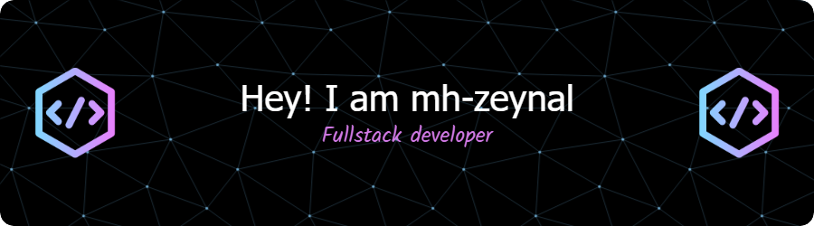

    
    
    
    
    

  
  
---
### Glad to see you here
</a>

I'm a full-stack web developer. I enjoy using angular, golang and spring boot a lot. So, don't come here for php stuff 😁.  
  
- 🔭 I’m currently working on building different webapps
- 🌱 I’m currently learning kubernetes and software deployment
- 🤔 I’m looking for help with learning blockchain development
- 📫 How to reach me: mh.zeynal@gmail.com
  
### I enjoy using:

    
    
    
    
    
    
    
    
    
    
    
    
    
    
    
    
    

  
---

    

  
  